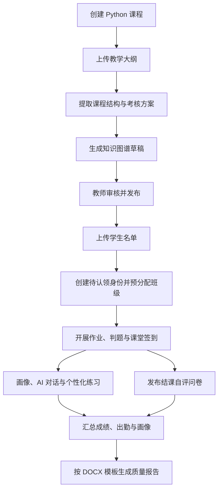

# 智学课堂——AI 驱动的个性化教学平台项目计划书

> 文档版本：2.5
>
> 更新时间：2026-08-09
>
> 当前阶段：MVP 已验收；V1.0 迭代一至四、迭代五 A 已通过专项验收；迭代五 B–D 已实现并进入五 E 环境验收

> 本次更新：依据代码、Prisma Schema、migration、自动化测试与迭代四、迭代五阶段性验收记录校准进度；完成后续关键路径、拆分交付和质量门禁优化

---

## 一、项目概述

### 1. 项目名称

暂定：**智学课堂——AI 驱动的个性化教学平台**

### 2. 项目定位

智学课堂是一个面向高校课程教学场景的智能教学平台，服务于管理员、教师和学生三类用户。

平台以课程教学数据为基础，连接课程建设、班级管理、作业测评、成绩分析、知识图谱、学生画像、个性化练习和教学质量分析，形成以下两条闭环：

**学生学习闭环：**

> 教师组织课程与题目 → 学生学习和作答 → 系统记录学习证据 → 更新学情画像 → 推荐针对性练习 → 学生再次练习 → 持续更新知识掌握状态

**教师教学改进闭环：**

> 导入教学大纲与学生名单 → 建立课程知识结构 → 采集成绩和出勤数据 → 分析班级学情与课程目标达成情况 → 生成教学质量分析 → 教师确认改进措施 → 反哺后续教学

### 3. 当前建设原则

1. **先做深一门课，再做通多门课。** 下一阶段以“Python 程序设计”为课程模板，先验证完整教学流程，再抽象课程配置能力。
2. **结构化计算优先，AI 负责增强。** 成绩、权重、正确率、达成度等数据由确定性程序计算；AI 负责文档理解、关系抽取、诊断解释和文本生成。
3. **教师始终拥有最终决定权。** AI 提取的知识点、生成的题目、画像结论和质量分析均应可追溯、可修改、可确认。
4. **先推荐题库题，再生成新题。** 正式作业和考试优先使用经教师审核的题库；AI 动态出题作为后续增强能力。
5. **数据可解释、可追踪、可回退。** 关键结论应能追溯到课程材料、题目、成绩或学习记录，并保存版本和生成依据。

### 4. 用户角色

- **管理员**：管理用户、平台配置、公共资源、审计与运行状态。
- **教师**：创建课程与班级、导入材料和名单、维护知识图谱与题库、组织教学、查看学情、生成教学质量分析。
- **学生**：完成课程学习与测评、查看成绩和学情画像、完成个性化练习、获取学习建议。

---

## 二、项目现状与版本路线

### 1. MVP 版本——已完成并通过演示验收

MVP 已经形成稳定的核心业务闭环，不再作为待开发范围。

已完成能力包括：

| 模块 | 已完成能力 |
| --- | --- |
| 账号与权限 | 管理员、教师、学生登录与角色隔离；服务端身份、角色和资源归属校验 |
| 管理员治理 | 用户管理、系统配置、系统公告、审计记录 |
| 班级管理 | 教师创建班级、管理成员；学生加入班级 |
| 题库管理 | 单选、多选、判断、填空、简答题管理；知识点和难度标签 |
| 作业流程 | 教师创建并发布作业；学生查看、自动保存、提交 |
| 批改与成绩 | 客观题自动批改、简答题人工批改、成绩发布与查询 |
| 学情分析 | 学生和班级基础分析、知识点掌握情况、AI 学习建议 |
| 个性化学习 | 个性化推荐练习、推荐记录、错题本复习 |
| 通知 | 作业发布、截止提醒、批改完成、分析完成、推荐更新和系统公告等站内通知 |
| 工程质量 | Prisma 数据模型、Zod 校验、AI 服务抽象、异常降级、测试与构建流程 |

MVP 的价值在于验证了：

> 教师建班和出题 → 发布作业 → 学生作答 → 自动与人工批改 → 发布成绩 → 学情分析 → 推荐练习 → 错题复习

后续版本应在保留该闭环的基础上扩展，不重复建设已有能力，也不破坏现有权限和数据隔离规则。

### 2. V1.0 当前进度（截至 2026-08-09）

当前进度以 Prisma Schema、migration、服务层、页面、API 和自动化测试为事实来源。V1.0 尚未完成整体验收，不能把局部能力完成等同于版本完成。

| 迭代/能力 | 状态 | 已落地 | 尚缺 |
| --- | --- | --- | --- |
| 迭代一：课程模型与导入基础 | 已完成并通过专项验收 | 课程模板与课程、班级关联、版本化文件、名单解析/映射/预览、待认领身份、唯一学号认领、自动入班、幂等、并发控制和审计 | 名单执行后台任务化不在当前完成范围内 |
| 迭代二：教学大纲解析 | 已完成并通过专项验收 | 文本型 PDF 提取、AI 结构化 Schema、实践项目、来源引用、严格校验、解析诊断、审核修订、显式发布、历史版本和固定样本验收记录 | OCR、持久化后台 worker、可选材料完整分类入口 |
| 迭代三：知识图谱 | 已完成并通过专项验收 | 正式大纲确定性转换、AI `RELATED` 增强及失败降级、任务状态、不可变审核修订、图形缩放/筛选、节点/关系审核、发布前差异、PostgreSQL 节点/关系和历史版本 | 学生端图谱与推荐联动 |
| 迭代四：成绩与出勤台账 | 已完成并通过专项验收 | 大纲派生并审核发布考核方案、课程/班级成绩台账、平台作业同步、固定模板导入导出、特殊状态、成绩发布、签到及纠正、版本化课程目标达成度 | 定位/人脸/二维码签到不在 V1.0 范围；旧版 `.xls` 只作为导入格式，导出为同结构 `.xlsx` |
| 迭代五：题目映射、基础判题与画像 | 已实现，待五 E 环境验收 | 五 A 任务/事件/沙箱契约；五 B Python 配置冻结、异步判题、证据闭环和师生界面；五 C 不可变画像快照与证据下钻；五 D 外部 AI 候选、失败降级和教师确认 | 空库 migration、权限和全量回归已通过；真实远程故障恢复/安全探测仍受专用节点 SSH 授权阻塞 |
| 迭代六：个性化推荐 | V1.0 联动未开始 | MVP 已有通用推荐、推荐练习和错题闭环 | 课程图谱/新掌握度联动、自主选知识点练习、AI 自述与结构化练习条件 |
| 迭代七：问卷与质量报告 | 未开始 | 无 | 结课问卷、匿名汇总、DOCX 模板映射、统计快照和报告生成 |
| 迭代八：整合与验收 | 未开始 | 持续保留原 MVP 自动化回归 | V1.0 全流程界面整合、端到端验收、部署与演示脚本 |

当前里程碑结论：统一学习事件、Python 异步判题、追加式成绩证据、掌握度修订、确定性画像快照和师生证据界面已经贯通。当前优先完成迭代五 E 的真实环境与全量回归门禁；只有五 E 通过后才进入课程图谱驱动推荐。所有新能力继续保留已发布大纲、图谱、考核方案、成绩、作业绑定和证据修订的历史可解释性。

迭代二、三专项验收记录见 `docs/ITERATION-TWO-THREE-ACCEPTANCE.md`，迭代四验收记录见 `docs/ITERATION-FOUR-ACCEPTANCE.md`，迭代五已落地基础链路的阶段性验收见 `docs/ITERATION-FIVE-ACCEPTANCE.md`。大纲解析异常消息契约已修复，并新增固定样本 3 项目标、11 章、8 个实验项目、32/20/12 学时和 5 项权重合同测试；最新全量质量检查结果以实际命令输出和各专项验收记录为准。

### 3. 后续关键路径与开发优化

后续不再把“判题、画像、推荐、问卷、报告”同时铺开，而是沿一条可验收的数据链推进：

> 正式图谱与题目绑定 → Python 判题/既有作答形成统一学习事件 → 生成可追溯画像快照 → 课程图谱驱动推荐 → 问卷与成绩/出勤汇总 → DOCX 质量报告

优化后的交付顺序：

| 优先级 | 阶段 | 核心交付 | 进入下一阶段的门禁 |
| --- | --- | --- | --- |
| P0 | 迭代五 A：任务与证据契约 | 定义最小统一学习事件、判题任务状态、幂等键、重试语义和结果引用；完成沙箱技术验证 | 事件可重放；任务重试不重复写入；网络、文件、进程、时间和内存限制有自动化安全测试 |
| P0 | 迭代五 B：Python 基础判题纵切 | 编程题配置、公开样例运行、隐藏用例异步判题、确定性评分、错误分类、结果入学习事件/知识证据 | 同代码同用例结果一致；隐藏用例不泄露；判题故障不阻塞普通提交和已发布成绩 |
| P0 | 迭代五 C：画像与证据呈现 | 不可变画像快照、置信度/证据不足规则、掌握度与证据师生界面 | 同输入和规则得到同快照；结论可下钻证据；师生与跨课程权限测试通过 |
| P0 | 迭代五 D：批量题目映射 | 候选批次、教师预览/修改/确认、版本元数据和失败降级 | 未确认候选不进入正式绑定；不覆盖人工绑定；远程内容出域须显式授权 |
| P0 | 迭代五 E：整体验收 | 空库 migration、真实沙箱故障恢复/安全探测、权限、回滚和全量质量命令 | 所有门禁通过后才把迭代五标为整体完成 |
| P1 | 迭代六：课程内推荐闭环 | 复用 MVP 练习流程，改为消费正式课程图谱、画像快照和已审核题库；补自主练习与结构化条件确认 | 候选范围、教学进度、难度、近期重复和版本引用均可验证 |
| P1 | 迭代七 A：结课问卷 | 从正式大纲生成可审核问卷，复用任务发布能力，完成实名/匿名汇总和小样本保护 | 不计入成绩；匿名关联不可见；统计口径可复算 |
| P1 | 迭代七 B：质量报告 | 先完成确定性数据快照、模板字段映射和基础 DOCX，再接入 AI 分析文字 | 无 AI 仍可生成；数值与正式成绩/达成度一致；DOCX 通过打开与版式校验 |
| P1 | 迭代八：整合验收 | 串联教师课程分析中心和学生学习中心，补端到端、部署、演示及故障降级 | V1.0 核心流程连续演示且 MVP 回归通过 |

执行约束：

1. 每个阶段按“数据模型与迁移 → 服务 → API → 最小界面 → 权限/异常/回归测试”完成纵向闭环，不交付只有页面或只有表结构的半成品。
2. 同一时间只推进一个高风险基础能力；Python 沙箱通过安全门禁后，才扩大到画像和推荐集成。
3. 后台任务只抽取判题、画像、批量匹配、报告共同需要的最小状态机，不提前建设通用工作流平台。
4. 确定性结果先于 AI 增强交付；AI 批量映射、解释和报告文字失败时，基础流程仍可用。
5. OCR、定位/人脸/二维码签到、AI 动态正式出题、多维代码评分继续留在后续版本，不占用 V1.0 关键路径。

### 4. V1.0——Python 程序设计课程模板

目标：将现有通用 MVP 完善为一个能够实际支撑“Python 程序设计”课程教学、评价和个性化学习的课程模板。

核心交付：

- 以已提供的《Python 程序设计（2024 版）课程教学大纲》PDF 作为首个解析样本
- 以已提供的 `.xls` 表格列结构作为学生名单与成绩交付模板
- 学生身份自动匹配或预导入、唯一学号认领注册和自动入班
- 教学大纲结构化解析
- Python 课程知识图谱生成、审核与发布
- 知识点与题库题目的双向关联
- 成绩项目和成绩表单自动生成
- 平台课堂签到、作业、测验、考试和学习行为数据汇总
- 教学质量问卷生成、发布和汇总
- 学生学情画像与班级学情分析
- 学生自主选择知识点练习，以及通过 AI 对话形成自我画像
- 基于知识点掌握状态的个性化题目推荐
- Python 编程题在线运行与基础自动判题
- DOCX 教学质量分析模板上传、字段映射和报告生成
- 教材、课件和实践指导书等教学材料的可选上传入口
- 与参考图一致的学生“AI 个性化学习中心”

### 5. V1.1——Python 智能测评增强

目标：在 V1.0 稳定运行后，增强 Python 编程题的多维评价、AI 出题和学习路径能力。

建议范围：

- 编程题原子功能点拆解
- 测试用例结果、代码语义、AST 结构和代码规范的多维反馈
- 基于课程材料检索的 AI 辅助出题
- AI 题目事实核验、答案一致性检查和质量审查
- Bloom 认知层级控制
- 基于知识图谱先修关系的学习路径推荐
- 诊断测验和阶段性自适应练习

### 6. V2.0——可复用课程模板平台

目标：将 Python 课程中验证有效的结构抽象为可配置的课程模板，使平台能够较低成本扩展到其他课程。

核心方向：

- 可配置的课程模板 Schema
- 可配置的教学大纲字段提取规则
- 可配置的知识点类型和关系类型
- 可配置的成绩构成、画像指标和推荐权重
- 可配置的题型与评分插件
- 可配置的教学质量报告字段
- 课程模板复制、版本管理和发布
- 多课程知识图谱隔离与复用

### 7. 暂不纳入近期范围

- 视频直播课堂
- 家长端
- 付费功能
- 复杂排课系统
- 多校区或多租户商业化能力
- 大规模互联网题库爬取
- 无教师审核的正式考试自动出题
- 多语言编程评测
- 多模态手写公式识别

---

## 三、V1.0 总体目标与成功标准

### 1. 业务目标

教师只需要确认课程基础信息，并完成三项核心配置，即可快速建立一个可运行的 Python 课程空间：

1. 上传已约定格式的**教学大纲 PDF**。
2. 上传与样表列结构一致的**学生名单 `.xls`/`.xlsx`**。
3. 在临近结课时上传或选择**DOCX 教学质量分析模板**。

系统自动完成大部分初始化工作，并将 AI 提取结果交给教师确认。

教材、课件、实践指导书等教学材料在 V1.0 保留上传入口，可作为知识点说明、AI 对话和后续出题的补充证据，但不是课程初始化、日常教学或报告生成的必填项。

### 2. 核心流程



### 3. V1.0 目标验收结果（尚未整体达成）

V1.0 完成后，应能够连续演示以下流程：

1. 教师创建“Python 程序设计”课程。
2. 上传《Python 程序设计（2024 版）课程教学大纲》样本，系统正确提取 3 项课程目标、11 章理论教学内容、8 个实验项目、考核方式及权重。
3. 系统生成知识图谱草稿，并标记来源、置信度和待确认项。
4. 教师修改后发布知识图谱。
5. 教师上传与样表相同格式的 `.xls`/`.xlsx` 名单，系统展示导入预览、重复项和错误项。
6. 已注册学生被匹配并加入班级；未注册学生创建待认领身份和班级预分配关系。
7. 学生使用唯一学号和名单姓名完成账号认领，系统在同一事务中创建学生账号、绑定身份并加入对应班级。
8. 系统根据大纲生成“平时表现 10% + 课程作业 5% + 期中考试 5% + 课程实验 20% + 期末考试 60%”的初始成绩构成，教师确认后生效。
9. 教师发起课堂签到，学生在限定时间内签到，教师可补录或纠正异常状态。
10. 题库题目与知识图谱中的知识点建立关联。
11. 学生完成客观题、主观题和 Python 编程题；编程题可在线运行并按测试用例基础判题。
12. 学生完成学习和测评后，系统更新其知识掌握状态与学习画像。
13. 学生可主动选择知识点发起练习，也可通过 AI 对话完成学习反思和自我画像。
14. 系统从已审核题库中生成可解释的个性化练习推荐。
15. 学生在个性化学习中心查看知识图谱、趋势、热力图、诊断和推荐路径。
16. 系统依据大纲中的课程目标和评价标准生成结课自评问卷，教师在作业发布流程中选择“问卷”类型并统一发布。
17. 教师上传已提供的 DOCX 质量分析模板，系统参考实际成品填充课程信息、成绩分布、课程目标达成情况、学生评价、课程总结和改进措施。
18. 系统生成可下载的 DOCX 报告；教师在平台外自行审查和后续处理，V1.0 不建设线上审批、签字或二次审核流程。

---

## 四、教师端功能设计

### 1. 课程初始化向导

教师创建课程时，系统提供分步骤向导：

1. 填写课程名称、课程代码、学期、班级和授课教师。
2. 选择“Python 程序设计”模板。
3. 上传教学大纲。
4. 查看并确认结构化提取结果。
5. 上传学生名单。
6. 查看账号匹配和入班结果。
7. 查看待认领学生数量并通知学生通过注册页认领。
8. 确认成绩构成。
9. 按需上传教材、课件或实践指导书。
10. 发布课程。

每一步均需提供：

- 当前处理状态
- 错误提示
- 可重新上传或重新解析
- 草稿保存
- 操作日志

### 2. 教学大纲导入与解析

#### 2.1 首期支持格式

- 必须支持文本型 PDF。
- 《Python 程序设计（2024 版）课程教学大纲》作为 V1.0 固定解析与验收样本。
- DOCX 可保留兼容入口，但不作为 V1.0 必须通过的验收格式。

扫描版 PDF 的 OCR 可作为后续增强。首期遇到无法可靠提取的扫描件时，应提示教师更换文件或手动补充。

#### 2.2 自动提取内容

系统应尽可能提取：

- 课程名称、课程代码、学分和总学时
- 理论学时、实验学时
- 课程性质和适用专业
- 课程简介
- 课程目标
- 章节和教学单元
- 每个教学单元的知识点
- 知识点的先修关系
- 重点、难点和易错点
- 教学进度和建议学时
- 课程目标与知识点的对应关系
- 考核项目、考核方式和成绩权重
- 课程目标与考核项目的对应关系
- 各考核方式的分档评分标准
- 可转化为学生结课自评问卷的课程目标、能力描述和评价维度
- 教材和参考资料

针对已提供样本，系统至少应正确识别以下基准结果：

| 项目 | 样本中的期望结果 |
| --- | --- |
| 课程目标 | 3 项：知识、能力、素养 |
| 理论教学 | 11 章，共 20 学时 |
| 实践教学 | 8 个实验项目，共 12 学时 |
| 总学时 | 32 学时 |
| 考核方式 | 平时表现、课程作业、期中考试、课程实验、期末考试 |
| 总成绩权重 | 10%、5%、5%、20%、60% |
| 评价口径 | 课程目标与各考核方式的对应比例、90-100 至 0-59 的分档评分标准 |

#### 2.3 提取结果确认

AI 解析结果不得直接成为正式课程数据，应先进入“待审核草稿”。

教师可以：

- 对照原文查看来源页码或章节
- 修改字段
- 合并或拆分知识点
- 增加或删除知识点
- 调整先修关系
- 标记重点、难点和易错点
- 重新解析某一章节
- 发布或撤回知识图谱版本

#### 2.4 可选教学材料

课程设置页保留教材、课件、实践指导书和其他教学材料的上传入口。

- 这些文件在 V1.0 中均为可选，不得阻塞课程创建、学生导入、作业发布或报告生成。
- 已上传材料可作为知识点说明、AI 对话和后续 AI 出题的补充证据。
- 只有经过教师授权的课程材料才能用于当前课程的检索和 AI 处理。
- V1.0 不要求教师必须上传完整教材，也不以材料齐全作为验收条件。

### 3. 学生名单导入与账号创建

#### 3.1 固定模板格式

V1.0 以已提供的 `计算机程序设计（Python）Ⅲ(02)录入成绩模板.xls` 作为固定模板，优先支持：

- `.xls`
- 与原表头完全一致的 `.xlsx`

当前样表包含 1 个工作表、10 列和 96 条学生数据，V1.0 验收时应能完整识别 96 条记录。

模板包含以下 10 列，导入时不得擅自改名或改变顺序：

1. 学年学期(文本)
2. 课程号(文本)
3. 学号(文本)
4. 姓名(文本)
5. 班级(文本)
6. 成绩标识(文本)
7. 期末成绩(100.0%)(文本)
8. 特殊原因(文本)
9. 等级成绩类型(文本)
10. 备注(文本)

课程初始化和账号创建使用前 5 列中的课程与身份信息。其中：

- 学号、姓名、班级用于学生身份和班级归属。
- 学年学期、课程号用于校验名单是否属于当前课程。
- 后 5 列在账号创建时原样保留但不作为身份判断依据，可在期末成绩导入或导出时复用。
- 学号必须按文本读取，禁止科学计数法、前导零丢失或自动转为数值。

V1.0 不要求名单包含邮箱或手机号，也不使用自由格式 Word、PDF 或任意表头 CSV 作为账号导入输入。

#### 3.2 导入规则

系统以**学号**作为学生身份匹配的主要依据：

- 学生默认登录账号使用学号；现有邮箱登录方式继续兼容。
- 学号已存在：不重置账号密码，只将学生加入当前课程班级。
- 学号不存在：创建待认领学生身份和班级预分配关系，不生成默认密码。
- 姓名相同但学号不同：视为不同学生。
- 学年学期或课程号与当前课程不一致：进入待确认列表，不直接导入。
- 学号重复、缺失或格式非法：进入错误列表，不直接导入。
- 同一名单重复导入：保持幂等，不重复创建账号和班级成员。

#### 3.3 身份认领与安全

- 名单导入不创建默认密码账号，只保存待认领身份和班级预分配关系。
- 学生在注册页使用唯一学号和名单姓名认领，并自行设置符合强度要求的密码。
- 注册必须校验学号存在、姓名匹配、身份未认领和邮箱未注册。
- 注册角色固定为学生，客户端不能指定或提升角色。
- 用户创建、身份绑定、认领状态更新和班级成员关系写入同一事务。
- 重复认领和并发认领只能有一个请求成功，事务失败必须完整回滚。
- 教师只能发起后续密码重置，不能查看学生密码。
- 名单导入和身份认领写入必要的安全日志，且不得记录密码或敏感学生数据。
- 历史一次性账号与首次改密流程只用于兼容已有账号，不用于新名单导入。

#### 3.4 导入交互

导入分为四步：

1. 上传文件。
2. 按固定 10 列模板校验表头、学号文本格式、学期和课程号。
3. 预览“新增账号、匹配账号、已在班级、错误数据”。
4. 教师确认后执行导入，查看成功、跳过和失败结果，并通知待认领学生注册。

### 4. Python 课程知识图谱管理

#### 4.1 默认知识框架

Python 模板可提供默认框架作为大纲解析的辅助参考，但最终结构以教师上传的大纲为准。

建议默认模块包括：

- Python 环境与程序基本结构
- 变量、数据类型和运算符
- 输入与输出
- 分支结构
- 循环结构
- 字符串
- 列表、元组、字典和集合
- 函数、参数和作用域
- 模块与包
- 异常处理
- 文件操作
- 面向对象程序设计
- 常用标准库
- 综合实践或课程项目

#### 4.2 节点类型

- 课程
- 课程目标
- 教学模块
- 章节
- 知识点
- 能力点
- 易错点
- 考核项目
- 题目
- 学习资源

#### 4.3 关系类型

- 包含
- 先修
- 后续
- 相关
- 属于
- 支撑课程目标
- 由考核项目评价
- 由题目考查
- 容易混淆
- 推荐学习

#### 4.4 节点属性

每个知识点至少包含：

- 名称和唯一编码
- 简介
- 所属章节
- 建议学时
- 重要程度
- 难度
- Bloom 认知层级
- 是否重点、难点或易错点
- 来源文档和原文位置
- 提取置信度
- 审核状态
- 版本号

#### 4.5 发布机制

- 草稿图谱允许重复修改。
- 发布后用于题目关联、画像计算和推荐。
- 新版本发布前展示增删改差异。
- 已产生历史学习数据的知识点不得直接删除，应采用停用或合并迁移。

### 5. 题库与知识点关联

题目和知识点采用多对多关系：

- 一道题可对应多个知识点。
- 一个知识点可对应多道题。
- 每道题可设置一个主要知识点和若干次要知识点。
- 每个关联可记录考查权重、认知层级和关联置信度。

关联方式：

1. 教师手动选择。
2. 依据题干、答案、解析和课程材料自动推荐。
3. 批量导入题目时自动匹配。
4. 教师批量审核、修改和确认。

只有已确认的知识点关联才能进入正式画像计算和个性化推荐。

题目质量信息建议增加：

- 来源
- 审核状态
- 使用次数
- 正确率
- 区分度
- 难度校准值
- 最近使用时间
- 是否适合推荐练习
- 是否适合正式考试

### 6. 成绩项目与成绩表单

#### 6.1 自动生成

系统根据教学大纲中的考核方式生成成绩项目，例如：

- 出勤
- 平时作业
- 实验
- 单元测验
- 阶段考试
- 课程项目
- 期末考试

教师可以修改名称、权重、满分、次数和统计规则。

针对已提供的大纲样本，系统默认生成：

> 总评成绩 = 平时表现 × 10% + 课程作业 × 5% + 期中考试 × 5% + 课程实验 × 20% + 期末考试 × 60%

#### 6.2 校验规则

- 所有成绩项目权重之和必须为 100%。
- 缺考、缓考、作弊和免修等特殊状态与普通零分区分。
- 修改已发布成绩必须保留修改人、修改时间和修改原因。
- 期末总评由程序计算，AI 不参与分数计算。
- 大纲中的考核方案发生变化时，应生成新版本，不直接覆盖历史数据。

#### 6.3 数据来源

- 平台作业和测验自动汇总
- 教师手动录入
- 按已提供 `.xls`/`.xlsx` 模板批量导入或导出
- 后续对接学校教务系统

#### 6.4 课程目标达成度

如果教学大纲包含课程目标及其考核映射，系统可进一步计算：

- 单项考核达成度
- 单个课程目标达成度
- 班级整体达成度
- 达成度分布
- 未达成目标及其关联知识点

达成度计算口径优先从教学大纲中的课程目标、考核方式对应比例和分档评分标准提取。系统生成计算规则草稿，经教师确认后执行，并保存规则版本。

### 7. 出勤管理

V1.0 支持：

- 教师创建课堂签到场次并设置开始、结束时间
- 学生在平台内完成签到
- 结束后系统自动将未签到学生标记为缺勤
- 教师补录或纠正迟到、早退、请假、缺勤等状态
- 正常、迟到、早退、请假、缺勤等状态
- 按周次和日期统计
- 与学生名单自动关联
- 签到结果写入学习事件、班级分析和教学质量报告数据快照

出勤数据可用于学习投入和风险提示，但**不得直接等同于知识掌握程度**。

V1.0 不强制加入定位、人脸识别或教务系统同步；动态签到码、二维码和防代签策略可在基础签到稳定后增强。

### 8. 班级学情分析

教师可以查看：

- 班级成绩分布
- 平均分、及格率、优秀率
- 各考核项目趋势
- 各知识点掌握率
- 课程目标达成度
- 高频错误和易错知识点
- 学生分层
- 学习投入和出勤情况
- 风险学生列表
- 推荐教学调整建议

所有 AI 建议都应附带数据依据，例如：

> “循环结构掌握率较低”的依据是哪些题目、多少学生、正确率变化以及对应教学单元。

### 9. 结课教学质量自评问卷

#### 9.1 问卷口径

系统从教学大纲中提取以下内容，生成问卷草稿：

- 课程目标及其知识、能力、素养描述
- 教学内容和学生学习预期成果
- 考核方式与分档评分标准
- 实验项目与实践能力要求
- 教学方法、考核方式和学习支持等质量评价维度

默认采用 5 级量表，并允许增加开放题。系统应明确区分：

- 学生对课程目标达成情况的自我评价
- 学生对教学内容、教学方法、考核方式和学习支持的评价
- 学生的意见与改进建议

#### 9.2 发布方式

- 在现有作业发布流程中增加“普通作业 / 练习 / 问卷”任务类型。
- 教师选择“问卷”后，可编辑系统根据大纲生成的题目、选项和说明。
- 问卷用于临近结课时统一发布，支持设置发布时间、截止时间和目标班级。
- 问卷结果不计入课程成绩。
- 教师可选择实名或匿名收集；无论何种模式，报告只使用班级汇总结果和脱敏意见。
- 统计响应人数、响应率、各题均值、各课程目标自评结果和开放题主题。

#### 9.3 报告用途

问卷结果用于教学质量分析报告中的“学生评价”和课程目标定性分析，并与成绩计算得到的定量达成度分开呈现。AI 可以总结共性意见，但不得把学生自评直接当作客观成绩或替代课程目标定量达成度。

### 10. 教学质量分析文档

#### 10.1 输入

- 已确认的教学大纲结构化数据
- 学生名单
- 出勤记录
- 作业、实验、测验和考试成绩
- 课程目标达成度
- 结课教学质量自评问卷汇总
- 班级学情分析
- 教师上传的教学质量分析模板

#### 10.2 模板范围

V1.0 以已提供的 `课程教学质量分析报告模板(2024版）.docx` 作为固定模板，以 `计算机程序设计（Python）III-教学质量分析报告.docx` 作为成品对照样本。

系统至少应识别和填充：

- 课程基本信息
- 与教学大纲一致的课程目标
- 总评成绩构成与成绩分布图
- 课程目标达成度定量统计表
- 课程目标总体和分项目标分析图
- 每个课程目标的定性分析
- 学生评价问卷汇总与文字概括
- 课程总结和持续改进措施
- 模板中要求保留的附件名称与编号

审核意见、签字和日期区域保持模板原样，不由系统自动代填。

对于格式复杂或字段无法自动识别的模板，系统应提供一次性的字段映射界面，而不是直接猜测填充位置。

#### 10.3 生成原则

- 统计数字由确定性程序计算。
- AI 只根据结构化统计和教师模板生成分析性文字。
- 报告中的每个关键结论可追溯到数据快照。
- 保存模板版本、数据版本、提示词版本和模型版本。
- V1.0 只负责生成并提供 DOCX 下载，不建设在线编辑、审批、电子签名、二次审核或正式归档状态流转。
- 生成文件视为待教师审查的草稿，后续审查、修改、签字和提交由教师自行完成。
- PDF 导出不是 V1.0 必须能力。
- 生成后必须进行文件可打开性、表格结构、图表显示和关键字段完整性检查。

#### 10.4 推荐生成流程

1. 上传模板。
2. 自动识别标题、段落、表格和占位字段。
3. 教师确认字段映射。
4. 选择班级和数据统计时间范围。
5. 系统生成统计数据和图表。
6. 汇总结课自评问卷。
7. AI 生成学生评价概括、问题分析和改进建议。
8. 系统生成 DOCX 并提供下载。
9. 教师在平台外自行审查、修改和完成后续流程。

---

## 五、学生端功能设计

### 1. AI 个性化学习中心

页面布局参考用户提供的界面图，建议包含以下区域：

#### 1.1 学习脑图

- 以学生为中心展示当前课程知识模块。
- 使用颜色和状态标签表示“未学习、学习中、薄弱、基本掌握、稳定掌握”。
- 点击节点可查看掌握依据、相关题目、错题和建议。
- 支持按章节、课程目标或知识类型切换视图。

#### 1.2 学情概览

- 当前学习阶段
- 已学习知识点数量
- 薄弱知识点数量
- 待完成任务数量
- 近期正确率
- 学习进度

#### 1.3 学习趋势

- 作业成绩趋势
- 测验成绩趋势
- 知识掌握趋势
- 学习投入趋势
- 推荐练习完成趋势

不同指标应使用清晰图例，不将多个含义不同的数值混为一个“综合分”。

#### 1.4 知识掌握热力图

- 行：掌握等级或教学单元
- 列：核心知识点
- 单元格：掌握程度
- 支持查看计算依据和最近更新时间

#### 1.5 学习路径

- 已完成知识点
- 当前建议学习内容
- 前置知识缺口
- 下一步推荐内容
- 每一步预计题量或学习任务

#### 1.6 当前诊断

- 当前总体水平
- 主要优势
- 主要薄弱点
- 常见错误类型
- 学习风险
- 数据不足提示

#### 1.7 推荐练习与推荐路径

- 推荐知识点
- 推荐题目
- 推荐原因
- 难度
- 预计用时
- 是否已完成
- 完成后的掌握变化

#### 1.8 能力雷达图

Python 课程可展示：

- 基础概念
- 程序阅读
- 逻辑设计
- 代码实现
- 调试纠错
- 综合应用

雷达图用于展示多个维度，不应替代具体证据和改进建议。

#### 1.9 自主知识点练习

- 学生可从已发布知识图谱中主动选择一个或多个知识点。
- 可设置题型、题量和难度；系统仍需过滤未审核、超进度和近期重复题目。
- 系统同时展示“学生指定条件”和“平台基于画像的补充建议”。
- 自主练习结果写入学习记录并更新画像，但不计入正式课程成绩。

#### 1.10 AI 对话式自我画像

- 学生可直接与 AI 讨论“我掌握了什么、哪里困难、希望如何练习”等问题。
- AI 可以追问学习目标、理解程度、常见错误和学习习惯，并结合已有成绩、作答、签到和练习记录生成自我画像摘要。
- 学生可以确认、修改或删除由对话生成的自述信息。
- 对话中的学生自我判断作为“自我反思证据”单独保存，不得直接覆盖程序计算的知识掌握度。
- 当自述与客观学习数据冲突时，界面应同时展示两类依据，并建议通过诊断题进一步确认。
- 对话可直接转化为知识点练习请求，例如“我想复习循环结构，先给我 5 道基础题”。

### 2. 学情画像数据来源

画像使用的数据包括：

- 作业和测验成绩
- 题目作答结果
- 题目难度
- 题目关联知识点
- 作答时间
- 答案修改次数
- 重复作答次数
- 错误类型
- 错题复习情况
- 推荐练习完成情况
- 出勤记录
- 编程题测试用例和代码分析结果
- AI 答疑主题和频次
- AI 对话形成的自我反思、学习目标和学生确认结果
- 教材或学习资源进度（后续启用）

### 3. 学情画像维度

画像分为相互独立但可联合分析的五类指标：

| 维度 | 主要内容 |
| --- | --- |
| 知识掌握 | 各知识点当前掌握度、稳定性和更新时间 |
| 能力表现 | 概念理解、程序阅读、逻辑设计、编码实现、调试和迁移应用 |
| 学习过程 | 出勤、任务完成、练习频率、复习情况和学习进度 |
| 学习趋势 | 近期提升、波动、连续正确或连续错误 |
| 风险与建议 | 数据不足、持续薄弱、前置知识缺口、可能掉队和下一步建议 |

### 4. 画像生成规则

- 成绩和行为数据先由程序聚合。
- 每个知识点保存掌握度、证据数量、置信度和最近更新时间。
- 不同时间的数据采用时间衰减，近期证据权重更高。
- 一次偶然错误不直接将知识点判为“未掌握”。
- 出勤和活跃度影响学习风险，不直接替代知识掌握证据。
- AI 根据结构化结果生成自然语言诊断，不直接修改原始掌握分。
- 学生自述只进入自我反思维度，并标注来源和确认状态；需经诊断题或后续学习证据验证后再影响推荐置信度。
- 数据量不足时明确显示“证据不足”，不强行生成结论。
- 学生和教师可以查看画像依据。
- 教师可以对异常结论进行标记和修正。

### 5. 学生隐私与表达

- 发送给外部 AI 的数据使用匿名学生标识。
- 不发送姓名、学号、手机号等与分析无关的信息。
- 不使用“差生”“能力低”等永久化、污名化标签。
- 风险提示只对本人、任课教师和授权管理员可见。
- 支持查看画像更新时间和主要数据来源。
- 画像用于教学辅助，不作为未经教师确认的正式评价结论。

---

## 六、个性化出题与推荐设计

### 1. V1.0 定位

V1.0 的核心不是让大模型无限生成题目，而是：

> 将知识图谱中的知识点与题库题目可靠对应，再根据学生的掌握状态，从已审核题库中选择最合适的练习。

这样能够优先保证：

- 题目正确
- 难度可控
- 与教学大纲一致
- 推荐原因可解释
- 可以稳定测试

### 2. 两阶段推荐流程

#### 2.1 候选过滤

先排除：

- 不属于当前课程的题目
- 超出当前教学进度的知识点
- 未经审核的题目
- 缺少答案或解析的题目
- 学生近期已完成的重复题
- 已停用题目
- 与学生当前难度差距过大的题目

#### 2.2 候选排序

初始推荐分数建议为：

```text
推荐分数 =
薄弱知识点匹配度 × 35%
+ 先修与学习路径匹配度 × 20%
+ 难度适配度 × 15%
+ 错误类型匹配度 × 10%
+ 题目新鲜度 × 10%
+ 教师优先级 × 10%
```

上述权重应可配置，并通过实际使用数据逐步校准。

### 3. 难度调整规则

- 最近正确率低且多次连续错误：降低难度，先补前置知识。
- 正确率中等：保持当前难度，增加同知识点变式题。
- 正确率高且表现稳定：提高认知层级，增加综合或迁移题。
- 作答正确但耗时明显过长：保持难度，推荐熟练度练习。
- 连续依赖提示后答对：不直接视为稳定掌握。
- 推荐练习完成后必须更新画像，再生成下一轮推荐。

### 4. 冷启动

学生尚无足够数据时，采用：

1. 教学进度范围。
2. 教师设置的重点知识点。
3. 简短诊断测验。
4. 班级整体难度分布。
5. 学生自主选择的复习目标。

冷启动结果必须标记为“初始建议”，避免被误认为稳定画像。

### 5. 推荐结果结构

每次推荐保存：

- 学生
- 课程
- 目标知识点
- 题目
- 推荐分数
- 推荐理由
- 使用的画像版本
- 推荐规则版本
- 生成时间
- 是否接受
- 是否完成
- 完成结果
- 完成后的掌握度变化

### 6. 学生主动练习与对话转练习

V1.0 支持两种学生主动发起方式：

1. 在知识图谱或练习页选择知识点、题型、题量和难度。
2. 在 AI 对话中用自然语言说明复习目标，由系统转换为结构化练习条件并让学生确认。

自主请求仍然使用已审核题库，不绕过课程范围、教学进度、题目质量和权限过滤。若题库数量不足，应明确提示并允许学生调整条件，不在 V1.0 中临时生成未经审核的正式题目。

### 7. V1.1 AI 辅助出题

AI 生成题目应采用“课程证据检索 + 生成 + 审查 + 教师确认”的流程：

1. 选择知识点、题型、数量、难度和 Bloom 层级。
2. 从教学大纲、教材和已审核知识库中检索证据。
3. 基于证据生成题目、答案、解析和来源引用。
4. 检查事实正确性、答案一致性、题干清晰度、难度和重复度。
5. 未达到质量阈值时自动修正，但限制最大循环次数。
6. 教师审核后进入正式题库。

正式作业和考试不得直接使用未经教师审核的 AI 生成题目。

学生自测可使用临时 AI 题目，但必须：

- 明确标记为 AI 生成
- 提供依据知识点和课程证据
- 允许反馈题目错误
- 不直接计入正式成绩

### 8. Python 编程题：V1.0 基础判题与 V1.1 增强

结合“Python 程序设计”课程特点，V1.0 纳入在线运行与基础自动判题，V1.1 再增加多维评价。

V1.0 必须实现：

1. 教师创建 Python 编程题、标准代码、公开样例和隐藏测试用例。
2. 学生在浏览器中编辑代码并运行公开样例。
3. 提交后在隔离环境中执行隐藏测试用例。
4. 按测试用例通过情况和教师设定的分值规则计算可复现成绩。
5. 保存代码、运行结果、耗时、内存、错误类型和关联知识点。
6. 向学生返回通过情况和教师允许公开的反馈，不泄露隐藏测试用例。

V1.1 增强评分结构为：

1. **动态结果**：安全沙箱中的测试用例通过情况。
2. **功能覆盖**：题目要求拆解为原子功能点后，判断学生代码实现程度。
3. **结构分析**：通过 AST 分析程序结构、控制流程和关键逻辑。
4. **代码质量**：命名、注释、可读性和规范性。
5. **个性化反馈**：代码功能摘要、优点、不足和改进建议。

其中：

- 正式分数应以教师确认的评分规则和可复现结果为准。
- V1.0 只承诺测试用例驱动的基础判题，不承诺 AST、代码风格或 AI 语义评分。
- 静态分析用于补充解释，不应在证据不足时替代可执行测试。
- 评分任务应异步执行，避免阻塞提交接口。
- 代码必须在隔离沙箱中运行，并限制时间、内存、网络和文件访问。

---

## 七、论文参考内容与项目落地方式

### 1. 史玉娜《基于预训练模型的代码功能性理解与评分系统》

可借鉴内容：

- 使用 Tree-sitter 对存在语法错误的代码进行容错 AST 解析。
- 将编程题要求拆分为原子功能点。
- 从语义覆盖、逻辑结构、注释与代码一致性等维度提供反馈。
- 生成代码功能摘要、个性化评语和能力雷达图。
- 将耗时评分和报告生成作为异步任务处理。

在本项目中的定位：

- 用于 V1.1 Python 编程题评价增强。
- 重点吸收“多维反馈”和“部分实现可解释”的思想。
- 不直接照搬模型和权重；需要在本课程样本、教师评分规则和现有技术栈下重新验证。
- 后续可采用“动态测试为主、静态分析为辅”的组合方案。

### 2. 邵文杰《智能化教学辅助与评测系统》

可借鉴内容：

- 从教学大纲和教材中保留章节层级、知识点边界和实体关系。
- 使用知识图谱增强跨章节关联。
- 先检索课程证据，再进行问答或出题。
- 题目生成包含搜索、生成、审查、修正和提交环节。
- 通过题型、数量、难度和 Bloom 层级控制生成目标。
- 学生可按学习进度或自定义知识点发起个性化练习。
- 推荐与问答结果提供课程材料来源，增强可解释性。

在本项目中的定位：

- V1.0 吸收知识图谱、证据追溯和个性化练习入口设计。
- V1.1 再引入混合检索、图增强检索和受控 AI 出题。
- 不在第一步同时引入过多中间件；先验证课程数据结构和教学流程，再根据检索效果决定是否增加独立向量库或图数据库。

### 3. 参考图的页面映射

用户提供的“AI 个性化学习中心”界面可以映射为：

| 参考区域 | 本项目数据来源 | V1.0 实现 |
| --- | --- | --- |
| 学习脑图 | 课程知识图谱 + 学生知识状态 | 实现 |
| 智能概览 | 画像快照 + 当前任务 | 实现 |
| 学习趋势 | 作业、测验和推荐练习记录 | 实现 |
| 知识掌握热力图 | 知识点掌握度 | 实现 |
| 学习路径 | 先修关系 + 薄弱知识点 + 教学进度 | 基础版 |
| 当前诊断 | 结构化画像 + AI 解释 | 实现 |
| 推荐学习路径 | 推荐规则 + 知识图谱 | 基础版 |
| 能力雷达图 | Python 能力维度聚合 | 实现 |
| 练习统计 | 推荐记录和答题记录 | 实现 |

---

## 八、技术架构与实现原则

### 1. 现有技术栈继续保留

- Next.js App Router
- React
- TypeScript
- Tailwind CSS
- shadcn/ui
- Next.js API Routes / Server Actions
- Prisma ORM
- PostgreSQL
- Zod
- 统一 AI Service Layer

除非有明确收益，不在 V1.0 大规模更换现有技术栈。

### 2. 领域服务现状与新增能力

已落地并应继续复用：

- 课程、版本化文件与安全下载
- 固定 `.xls`/`.xlsx` 名单及成绩模板解析、校验和幂等执行
- 教学大纲解析、审核与正式发布
- 知识图谱生成、审核、版本差异与正式发布
- 考核方案、成绩台账、课堂签到和课程目标达成度
- 题目人工绑定、作业发布快照、答题知识证据与版本化掌握度
- 统一 AI Service Layer、审计、通知及既有 MVP 推荐服务

V1.0 仍需新增或补齐：

- 最小统一后台任务状态机和学习事件契约
- Python 代码隔离执行与基础判题服务
- 画像快照、证据聚合和师生查询界面
- AI 题目知识点批量匹配与教师审核
- 课程图谱驱动的推荐、自主练习与 AI 对话式自我画像
- 问卷生成、发布与匿名汇总服务
- DOCX 模板映射、确定性数据快照与报告生成

### 3. 知识图谱存储策略

V1.0 建议优先使用 PostgreSQL 中的节点表和关系表作为知识图谱的权威数据源。

理由：

- 与现有 Prisma/PostgreSQL 架构一致。
- 便于权限控制、事务、版本和迁移。
- 当前仅有 Python 单课程模板，图规模有限。
- 可先满足知识点关系、路径遍历和前端可视化。

当 V2.0 出现多课程大规模图检索、多跳推理或性能瓶颈时，再评估 Neo4j 等专用图数据库。

课程材料语义检索可优先评估 PostgreSQL + pgvector；只有在数据量、检索能力或运维需求明确时，再引入独立向量数据库。

### 4. 后台任务

以下未完成或长耗时操作应采用后台任务：

- 教学大纲解析
- 知识图谱生成
- 批量学生导入
- 题目知识点批量匹配
- 学生画像批量重算
- AI 出题与质量审查
- 教学质量文档生成
- Python 编程题运行与批量判题
- Python 代码静态分析（V1.1）

任务需要记录：

- 当前状态
- 处理进度
- 成功数量
- 失败数量
- 错误原因
- 发起人
- 开始和结束时间
- 是否允许重试

任务实现先满足判题、画像、批量匹配和报告生成的共同最小需求：明确状态转换、输入指纹、幂等键、进度、错误分类和重试次数。暂不为 V1.0 引入独立工作流编排平台；只有现有数据库任务模式无法满足吞吐、隔离或运维要求时，才评估外部队列。

### 5. AI 服务边界

统一 AI 服务层建议扩展为：

```typescript
interface AIProvider {
  parseSyllabus(input: SyllabusParseInput): Promise<SyllabusParseResult>;
  extractKnowledgeGraph(input: KnowledgeGraphInput): Promise<KnowledgeGraphDraft>;
  mapQuestionKnowledgePoints(input: QuestionMappingInput): Promise<QuestionMappingResult>;
  analyzeStudentPerformance(input: AnalysisInput): Promise<AnalysisResult>;
  analyzeSelfReflection(input: SelfReflectionInput): Promise<SelfReflectionResult>;
  explainRecommendation(input: RecommendationInput): Promise<RecommendationReason>;
  generateCourseSurvey(input: CourseSurveyInput): Promise<CourseSurveyDraft>;
  summarizeCourseSurvey(input: CourseSurveySummaryInput): Promise<CourseSurveySummary>;
  generateQualityAnalysis(input: QualityAnalysisInput): Promise<QualityAnalysisDraft>;
  generateQuestions(input: QuestionGenerationInput): Promise<GeneratedQuestion[]>;
  reviewQuestion(input: QuestionReviewInput): Promise<QuestionReviewResult>;
}
```

所有 AI 输出必须：

1. 使用结构化 Schema。
2. 通过 Zod 校验。
3. 记录模型和提示词版本。
4. 失败时最多按策略重试。
5. 失败后回退到规则计算或人工处理。
6. 不影响成绩查询、作业提交等核心功能。

### 6. 安全与权限

- 教师只能访问自己的课程、班级、学生和报告。
- 学生只能访问自己的画像、成绩和推荐。
- 文件下载必须验证课程归属。
- 学生名单和成绩文件不能使用永久公开链接。
- 新名单导入不生成账号表；历史账号表仅限原授权教师访问，且不进入普通文件列表。
- 匿名问卷不得向教师暴露单个学生身份与单份回答的关联。
- 文档解析服务只接收任务所需文件。
- 外部 AI 不接收无关的个人身份信息。
- 账号批量创建、成绩导入和报告导出写入审计日志。
- Python 代码执行必须使用隔离沙箱。

---

## 九、核心数据模型现状与后续调整

以下模型名分为“已实现基线”和“后续概念模型”。开发前必须以当前 Prisma Schema 和 migration 为准；不得用概念名称覆盖已经落地的版本化模型。

### 1. 课程与文档

- `Course`
- `CourseTemplate`
- `CourseDocument`
- `DocumentVersion`
- `SyllabusParseTask`
- `SyllabusParseResult`

### 2. 课程结构

- `CourseOutcome`
- `TeachingUnit`
- `KnowledgePoint`
- `KnowledgeRelation`
- `KnowledgeGraphVersion`
- `KnowledgeSourceReference`

### 3. 学生导入

- `StudentImportTask`
- `StudentImportRow`
- `CredentialDownloadRecord`

已有的 `User`、`Class` 和 `ClassMember` 应优先复用。

- `User` 需要增加唯一 `studentNumber` 或等价字段，登录接口同时兼容现有邮箱和学生学号。
- 不得为了满足现有邮箱唯一约束而为没有邮箱的学生伪造可投递邮箱地址。
- `StudentIdentityClassroomAssignment` 保存待认领身份与课程班级预分配关系；历史凭据下载记录不保存明文密码。

### 4. 成绩与出勤（已实现基线）

- `AssessmentSchemeDraft`、`AssessmentSchemeReviewRevision`、`PublishedAssessmentScheme`
- `PublishedAssessmentComponent`、`PublishedAssessmentOutcomeMapping`
- `CourseGradebook`、`GradeItem`、成绩记录与人工修订模型
- `GradebookPublication`、`GradebookPublicationStudent`
- `GradeImportBatch`、`GradeImportRow`
- `AttendanceSession`、`AttendanceRecord`、`AttendanceRecordRevision`
- `CourseOutcomeAttainmentRun`、`CourseOutcomeAttainmentResult`、`StudentOutcomeAttainmentResult`

上述正式方案、成绩发布和达成度结果均为追加版本，后续画像、问卷和报告只能引用明确版本，不得直接读取可变草稿冒充正式数据。

### 5. 题库与练习

已实现基线：

- `QuestionKnowledgeGraphBindingSet`、`QuestionKnowledgeGraphBinding`
- `AssignmentQuestionConceptSnapshot`
- `StudentAnswerConceptEvidence`
- `StudentCourseConceptMasteryState`、`StudentCourseConceptMasteryRevision`、`StudentCourseConceptMasteryEntry`

后续概念模型：

- `QuestionAtomicFeature`
- `QuestionQualityMetric`
- `ProgrammingTestCase`
- `CodeExecution`
- `CodeJudgementResult`
- `PracticePlan`
- `PracticePlanItem`
- `RecommendationRecord`

已有 `Question`、`Assignment`、`Submission` 和 `StudentAnswer` 应继续复用。

### 6. 学情画像

- `LearningEvent`
- `StudentKnowledgeState`
- `StudentAbilityState`
- `StudentProfileSnapshot`
- `StudentSelfReflection`
- `AIProfileConversation`
- `LearningRiskRecord`
- `AnalysisEvidence`

画像采用快照加事件的方式：

- 原始学习事件保留。
- 当前状态可以重算。
- 每次正式分析保存快照。
- 推荐记录引用当时的画像快照，便于解释。

### 7. 结课问卷与教学质量报告

- `CourseSurvey`
- `CourseSurveyQuestion`
- `CourseSurveyResponse`
- `CourseSurveySummary`

- `QualityReportTemplate`
- `TemplateFieldMapping`
- `QualityReportTask`
- `QualityReportDataSnapshot`
- `QualityReportArtifact`

报告模型只管理模板、生成任务、数据快照和输出文件，不设计审批人、签字状态或正式归档状态机。

---

## 十、页面与交互规划

### 1. 教师端新增页面

```text
/teacher/courses
/teacher/courses/new
/teacher/courses/:courseId/setup
/teacher/courses/:courseId/syllabus
/teacher/courses/:courseId/knowledge-graph
/teacher/courses/:courseId/students/import
/teacher/courses/:courseId/gradebook
/teacher/courses/:courseId/attendance
/teacher/courses/:courseId/surveys
/teacher/courses/:courseId/analytics
/teacher/courses/:courseId/quality-reports
/teacher/questions/knowledge-mapping
/teacher/questions/programming
```

### 2. 学生端新增或升级页面

```text
/student/courses/:courseId/learning-center
/student/courses/:courseId/knowledge-graph
/student/courses/:courseId/profile
/student/courses/:courseId/practice
/student/courses/:courseId/learning-path
/student/courses/:courseId/ai-profile-chat
/student/courses/:courseId/surveys
```

### 3. 关键交互要求

- 文档处理显示任务进度，不让用户长时间面对空白页面。
- AI 提取结果采用“原文—结构化结果”对照审核。
- 图谱支持缩放、筛选、搜索和节点详情。
- 所有图表提供文字摘要，避免只依赖颜色传达状态。
- 画像结论支持查看证据。
- 推荐题显示“为什么推荐给我”。
- AI 对话中的自然语言练习请求必须先转换为可见的知识点、题型、题量和难度条件，再由学生确认。
- 问卷发布沿用作业发布入口和截止时间交互，但明确标记“不计入成绩”。
- 报告生成支持模板映射确认、生成进度、结果预览和 DOCX 下载；不提供在线审批与签字。

---

## 十一、开发阶段安排

以下按功能依赖划分为八个迭代，不直接绑定固定日期。确认开发人数后再换算为周计划。

阶段管理采用以下统一门禁：

- **范围门禁**：开始前明确本阶段不做项，防止 OCR、通用多课程、动态正式出题和高级评分混入 V1.0。
- **数据门禁**：Schema、migration、历史数据影响、回填和回滚方案先于接口与页面评审。
- **安全门禁**：权限、跨课程访问、文件隐私、判题隔离和匿名性测试属于完成条件，不作为末期补项。
- **质量门禁**：相关单元/集成测试、类型检查、构建、Prisma 校验和差异检查通过后才能更新阶段状态。
- **演示门禁**：每个阶段至少保留一条可连续演示的正常流程和一条可恢复的异常流程。

### 迭代一：课程模型与导入基础

状态：**已完成并通过专项验收**。验收记录见 `docs/ITERATION-ONE-ACCEPTANCE.md`。

完成内容：

- 课程和课程模板基础模型
- 文件上传、权限和版本
- 固定 10 列 `.xls`/`.xlsx` 名单模板解析
- 表头、学号文本格式、学期和课程号校验
- 导入预览和错误清单
- 已有账号匹配入班、待认领身份创建和班级预分配
- 唯一学号认领注册、并发控制、事务回滚和自动入班
- 导入幂等与审计

验收重点：

- 重复导入不产生重复账号。
- 已注册学生不被重置密码。
- 非法数据不会部分污染正式数据。
- 学号保持文本格式，不丢失精度或前导零。
- 新导入不生成初始密码；学生使用唯一学号和名单姓名自主认领。

### 迭代二：教学大纲解析

状态：**已完成并通过专项验收**。验收记录见 `docs/ITERATION-TWO-THREE-ACCEPTANCE.md`。OCR、持久化后台 worker 和可选材料完整分类入口仍按后续增强处理。

完成内容：

- 已提供教学大纲 PDF 的文本与表格提取
- 教学大纲结构化 Schema
- AI 解析与 Zod 校验
- 原文引用和置信度
- 教师审核界面
- 解析任务重试与版本
- 教材、课件和实践指导书的可选上传入口

验收重点：

- 关键字段可追溯到原文。
- 样本中的 3 项课程目标、11 章、8 个实验项目和 5 项考核权重提取正确。
- 解析失败不影响教师手动录入。

### 迭代三：知识图谱

状态：**已完成并通过专项验收**。正式大纲到版本化图谱、AI 降级、审核发布、图形缩放/筛选、节点/关系审核和发布前差异已落地；学生端图谱与推荐联动仍属于后续画像和推荐范围。

完成内容：

- 节点、关系和版本模型
- Python 默认知识框架
- 从大纲生成图谱草稿
- 教师编辑和发布
- 图谱可视化
- 历史知识点迁移策略

验收重点：

- 发布图谱可供题目关联和画像计算使用。
- 修改不会破坏历史成绩和推荐记录。

### 迭代四：成绩与出勤台账

状态：**已完成并通过专项验收**。验收记录见 `docs/ITERATION-FOUR-ACCEPTANCE.md`。MVP 作业成绩继续保留，课程台账以正式考核方案、课程/班级上下文和不可变发布版本为准。

完成内容：

- 从大纲生成考核方案
- 成绩项目、权重和校验
- 平台成绩自动汇总
- 固定成绩模板导入、导出和人工录入
- 课堂签到场次、学生签到和教师纠正
- 课程目标达成度基础计算
- 正式方案、成绩发布和达成度的版本、指纹、过期提示和审计

验收重点：

- 总评计算准确并可复现。
- 特殊成绩状态与零分正确区分。
- 签到结果可追溯到具体场次，未签到与请假状态正确区分。
- 新成绩发布后旧达成度不会被静默覆盖，并能识别为过期。

### 迭代五：题目映射、基础判题与画像

状态：**五 B–D 已实现，五 E 环境验收中**。统一任务/学习事件、Python 判题、追加式证据、确定性画像和批量候选确认均已形成代码纵切；外部 AI 候选已获题干与课程 Concept 出域授权，并通过合成数据真实契约探测。空库 migration、权限和全量回归门禁已通过，真实远程故障恢复/安全探测仍受专用节点 SSH 授权阻塞，因此不能把迭代五标记为整体完成。

已完成基线：

- 题目—知识点多对多关系
- 教师人工维护主/次知识点并审核
- 发布作业时冻结题目绑定和图谱解析状态
- 自动/人工批改生成追加式知识证据
- 确定性课程掌握度、输入指纹、规则版本和不可变修订
- 师生按课程归属查询掌握度、历史修订和证据引用

迭代五按以下可独立验收阶段推进：

**迭代五 A：任务、学习事件与沙箱契约**

- 定义统一学习事件最小字段、来源引用、事件版本和幂等键
- 定义判题任务状态、错误分类、重试和结果可见性
- 验证隔离环境的 CPU、内存、时间、网络、文件、进程和输出限制

**迭代五 B：Python 基础判题**

- Python 编程题、公开样例和隐藏测试用例
- 隔离运行、资源限制和基础自动判题
- 判题结果写入统一事件并形成可解释知识证据

**迭代五 C：画像与证据界面**

- 学习事件归一化
- 能力维度和画像快照
- 掌握度、置信度、证据不足和证据查看界面

**迭代五 D：批量题目映射**

- 候选独立保存、教师批量审核、版本元数据和失败降级
- 不覆盖已有人工绑定；未确认候选不进入正式计算

**迭代五 E：整体验收**

- 空库 migration、真实远程沙箱、故障恢复、权限和全量回归

验收重点：

- 未审核关联不进入正式计算。
- 相同代码和相同测试用例得到一致、可复现的判题结果。
- 隐藏测试用例不会返回给学生。
- 同一数据和同一规则可以得到一致结果。
- 判题任务失败可重试且不会重复生成事件、证据或成绩。
- 旧作业不自动回填；如需回填，另行提交可审查的迁移与回滚方案。

### 迭代六：个性化推荐

状态：**V1.0 课程图谱联动未开始**。MVP 通用推荐、练习和错题能力作为复用基线保留。

完成内容：

- 候选过滤
- 可配置排序规则
- 冷启动
- 难度调整
- 推荐理由
- 推荐反馈闭环
- 学生主动选择知识点、题型、题量和难度
- AI 对话式自我画像与自然语言转练习条件

验收重点：

- 不推荐超出教学进度或未审核题目。
- 推荐原因可解释。
- 学生自述与客观画像分开保存和展示。
- 完成练习后画像和下一轮推荐能够更新。

### 迭代七：结课问卷与教学质量报告

状态：**未开始**。

完成内容：

- 从大纲生成课程目标和教学质量问卷草稿
- 在作业发布流程中发布结课问卷
- 问卷汇总、课程目标自评和开放题主题分析
- DOCX 模板上传
- 字段识别和人工映射
- 统计数据快照
- 按实际成品生成图表和分析文字
- DOCX 生成、预览和下载

验收重点：

- 问卷结果不计入成绩，匿名模式不暴露学生身份。
- 报告数值与成绩台账一致。
- 报告版式与已提供模板一致，审核意见和签字区域保持空白。
- AI 失败时仍可生成仅包含统计数据的基础报告。

### 迭代八：界面整合、测试与验收

状态：**未开始**；原 MVP 回归测试在各迭代中持续维护。

完成内容：

- AI 个性化学习中心
- 教师课程分析中心
- 课堂签到、编程判题、结课问卷和报告生成串联演示
- 端到端测试
- 权限和隐私测试
- 性能与后台任务测试
- 演示数据和演示脚本
- 部署文档和故障降级

验收重点：

- 完整演示 V1.0 核心流程。
- 保证原 MVP 功能不回归。

---

## 十二、测试与验收标准

### 1. 功能验收

#### 教学大纲

- 已提供 PDF 样本可正常上传和解析。
- 提取结果通过 Schema 校验。
- 3 项课程目标、11 章理论内容、8 个实验项目和 10%/5%/5%/20%/60% 考核权重与原文一致。
- 每个核心知识点可查看来源。
- 教师可修改并发布。

#### 学生名单

- 正确区分新增、已注册、已入班和错误数据。
- 严格校验固定 10 列表头，正确读取旧版 `.xls`。
- 已提供样表可识别为 96 条有效学生记录。
- 学号保持文本精度和原始格式。
- 重复导入幂等。
- 新导入不生成账号表或初始密码。
- 学生认领时自行设置强密码，历史一次性账号继续兼容首次改密。

#### 知识图谱

- 支持节点和关系编辑。
- 支持版本发布和差异查看。
- 题目可以关联主要和次要知识点。

#### 成绩与出勤

- 权重校验正确。
- 汇总分与人工计算一致。
- 修改留痕。
- 课程目标达成度可复算。
- 教师可创建签到场次，学生可在有效时间内签到。
- 未签到、迟到、请假和教师纠正记录准确且可追溯。

#### Python 编程题

- 公开样例可在浏览器中运行。
- 隐藏测试用例在隔离环境中执行且不泄露。
- 判题分数符合教师设置的测试用例权重。
- 超时、内存超限、运行错误和编译/语法错误可区分。
- 判题失败不阻塞普通题目提交和成绩查看。

#### 学情画像

- 每个结论有证据和更新时间。
- 数据不足时不给出过度确定结论。
- AI 对话中的学生自述与客观学习证据分开保存。
- 学生可确认、修改或删除自己的自我反思信息。
- 教师和学生权限隔离。

#### 个性化推荐

- 题目属于当前课程和已学范围。
- 不推荐近期重复题。
- 难度符合规则。
- 推荐理由和画像版本可追溯。
- 学生可主动选择知识点，也可通过 AI 对话生成练习条件。

#### 结课教学质量自评问卷

- 问卷题目可从大纲课程目标和评价标准生成。
- 教师可在作业发布流程中选择“问卷”并统一发布。
- 问卷结果不计入课程成绩。
- 匿名模式不向教师暴露学生身份与单份回答的关联。
- 响应率、量表结果、课程目标自评和开放题汇总正确。

#### 教学质量报告

- 统计数值与数据快照一致。
- 模板字段填充正确。
- 审核意见、签字和日期区域不自动代填。
- 导出文件可正常打开且版式完整。
- 系统只生成待审查 DOCX，不创建线上审批或正式归档状态。

### 2. 非功能验收

- 所有新增 API 验证身份、角色、资源归属和输入。
- 批量导入使用事务或可回滚策略。
- 后台任务失败可重试且不会重复写入。
- AI 服务故障不影响成绩、名单和作业等核心功能。
- 文件访问受权限保护。
- 学生隐私字段不发送给外部模型。
- Python 判题默认禁用网络并限制 CPU、内存、执行时间和文件访问。
- 学号认领注册、匿名问卷和报告下载分别通过专项权限测试。
- 原 MVP 测试、类型检查、构建和核心流程继续通过。

### 3. 建议质量指标

以下指标需在确定样本集后建立基线：

- 教学大纲核心字段提取准确率
- 知识点提取教师接受率
- 题目—知识点自动映射接受率
- Python 编程题判题一致率和任务失败率
- 推荐题完成率
- 推荐后知识点正确率变化
- 画像诊断教师认可率
- 学生自述与诊断结果的一致性
- 结课问卷响应率
- 报告字段自动填充成功率
- AI 生成内容教师修改率

这些指标用于持续改进，不应在没有真实数据集时预先承诺不现实的数值。

---

## 十三、主要风险与应对措施

### 1. 教学大纲格式差异大

风险：

- 不同教师和学院的大纲结构不同。
- PDF 可能是扫描件。
- 表格和合并单元格可能导致文本顺序错乱。

应对：

- 限定 V1.0 支持格式。
- 使用结构化 Schema 和字段置信度。
- 提供原文对照和人工确认。
- 保存课程级解析映射，供后续复用。

### 2. 名单误建账号或重复账号

应对：

- 以学号为主键匹配。
- 导入前预览。
- 重复导入幂等。
- 错误行隔离。
- 执行过程写审计日志。

### 3. 学生身份被冒领

应对：

- 名单学号全局唯一，并对学号和姓名执行规范化匹配。
- 学号必须处于待认领状态，重复或并发认领只能有一个成功。
- 注册邮箱必须未被使用，注册角色固定为学生。
- 用户创建、身份绑定、状态更新和课程入班处于同一事务。
- 认领失败使用统一安全提示，避免暴露额外学生信息。
- 教师只能发起密码重置，不能查看学生密码。

### 4. 知识图谱质量不足

应对：

- AI 只生成草稿。
- 标记来源和置信度。
- 教师审核后发布。
- 题目关联单独审核。
- 使用版本和迁移机制。

### 5. 学情画像标签化学生

应对：

- 画像使用可变化的状态而非永久标签。
- 展示证据、更新时间和置信度。
- 出勤与知识掌握分开。
- 提供数据不足状态。
- 只用于教学辅助。

### 6. AI 出题不准确

应对：

- V1.0 优先推荐审核题库。
- AI 出题必须检索课程证据。
- 自动检查答案一致性和重复度。
- 正式使用前必须教师审核。

### 7. 教学质量分析出现“数字正确、结论错误”

应对：

- 数字和图表由程序生成。
- AI 只接收结构化统计摘要。
- 关键结论附带数据依据。
- 生成文件明确作为“待教师审查”结果。
- 保存数据快照、模板版本和生成记录，便于教师发现问题后重新生成。

### 8. Python 代码执行安全

应对：

- 使用隔离沙箱。
- 禁止默认网络访问。
- 限制 CPU、内存、运行时间和文件系统。
- 清理临时环境。
- 记录异常和可疑行为。

### 9. AI 对话式画像过度依赖学生自述

应对：

- 自述、客观成绩、作答记录和签到数据分开保存。
- 自述信息必须由学生确认，并允许修改或删除。
- 自述不直接覆盖知识掌握分。
- 数据冲突时推荐诊断题，不由 AI 擅自裁决。

### 10. 结课问卷响应不足或匿名性受损

应对：

- 展示响应率和未响应比例，不用少量样本代表全班。
- 匿名模式只输出聚合结果和脱敏开放题。
- 小样本时限制细分统计，避免通过班级、题目组合反推身份。
- 问卷结果作为定性证据，不替代成绩和课程目标定量达成度。

### 11. 范围过大导致延期

应对：

- V1.0 只聚焦 Python 单课程模板。
- 先完成题库推荐，再做 AI 动态出题。
- 先使用 PostgreSQL 图模型，再评估专用图数据库。
- 编程题高级评分放入 V1.1。
- 每个迭代独立验收，不同时铺开所有模块。

---

## 十四、开发规范

### 1. 数据库

所有数据库修改必须：

1. 修改 Prisma Schema。
2. 创建 migration。
3. 说明已有数据迁移方案。
4. 更新必要的 seed 和测试数据。
5. 检查历史作业、成绩和画像是否受影响。

### 2. API

所有 API 必须：

1. 验证身份。
2. 验证角色。
3. 验证资源归属。
4. 使用 Zod 校验输入。
5. 返回统一响应格式。
6. 不直接返回数据库或第三方服务错误。

### 3. 前端

所有页面和异步任务必须具备：

- loading 状态
- empty 状态
- error 状态
- retry 或恢复路径
- 权限不足提示

### 4. AI

- 业务代码不得直接绑定具体模型。
- 提示词与业务逻辑分离。
- 输出必须结构化并校验。
- 保存模型、提示词和规则版本。
- AI 失败不得阻塞核心教学流程。

### 5. 每个迭代的交付要求

- 需求和验收标准
- 数据模型变化
- API 变化
- 页面变化
- 权限检查
- 正常与异常流程测试
- 数据迁移说明
- 演示步骤
- 已知限制

---

## 十五、已确认的 V1.0 产品决策

以下事项已确定，后续设计和开发以此为准：

1. 学生名单与成绩数据以已提供的 10 列 `.xls` 表格为固定模板，并兼容同表头 `.xlsx`。
2. 未注册学生形成待认领身份和班级预分配；学生使用唯一学号和名单姓名自主认领并自动入班。
3. 教学大纲以已提供的《Python 程序设计（2024 版）》PDF 为首个解析与验收样本。
4. 教学质量分析采用 DOCX 模板；已提供的空白模板和实际成品分别作为版式与内容验收依据。
5. 出勤数据由平台课堂签到功能产生，教师可补录和纠正。
6. Python 编程题在线运行与基础判题纳入 V1.0，多维静态评价保留在 V1.1。
7. V1.0 保留教材、课件和实践指导书等材料入口，但均为可选。
8. 学生可以主动选择知识点练习，也可以通过 AI 对话形成自我画像并发起练习。
9. 教学质量评价口径从教学大纲提取，并在作业发布流程中以结课问卷形式统一发布，收集学生自我评估。
10. 平台只负责生成 DOCX 报告，教师自行审查；V1.0 不实现二次审核、电子签名或审批流。

---

## 十六、最终建设路径

项目后续应按照以下顺序推进：

> MVP 已验收基线【已完成】
>
> → 课程、文件和批量导入基础【已完成】
>
> → 教学大纲结构化【已完成并通过专项验收】
>
> → Python 知识图谱【已完成并通过专项验收】
>
> → 成绩与出勤台账【已完成并通过专项验收】
>
> → 统一学习事件与判题安全契约【已完成五 A 专项验收】
>
> → Python 基础判题【已实现，待五 E 环境验收】
>
> → 学生学情画像【已实现，待五 E 环境验收】
>
> → 自主练习、AI 对话画像与个性化题库推荐【待开发】
>
> → 结课教学质量问卷【待开发】
>
> → DOCX 教学质量分析报告生成【待开发】
>
> → Python 多维评分和 AI 出题增强  
> → 可复用课程模板平台

这一顺序优先解决 V1.0 中安全风险和依赖最多的判题/学习事件链，再复用同一份证据完成画像与推荐，最后由已正式发布的成绩、达成度、出勤和问卷数据生成报告。这样可以减少重复数据模型、一次性后台任务和跨迭代返工，并在 Python 课程闭环稳定后再抽象通用配置。
